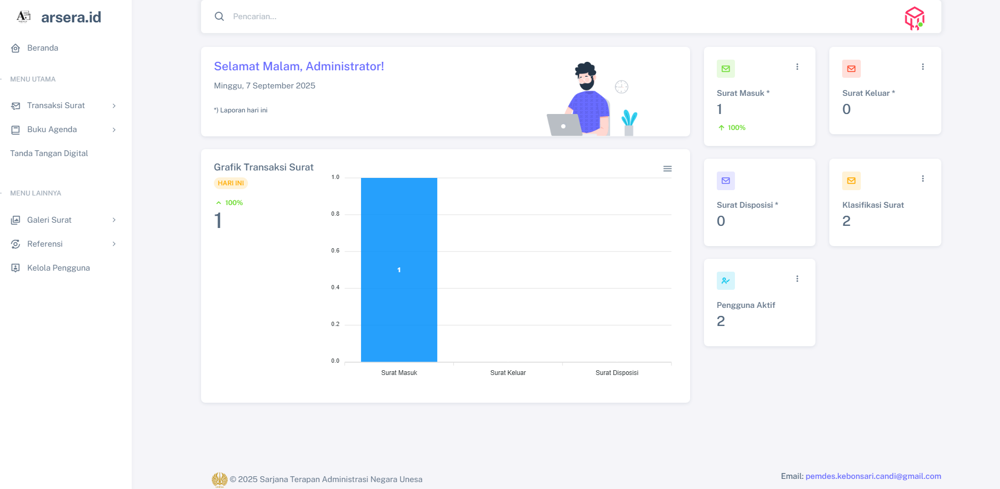

<p align="center">
  <a href="https://404notfound.fun" target="_blank">
    
  </a>
</p>

## Laravel Surat Menyurat v1 🚀

Sebuah aplikasi web yang dirancang untuk mengelola surat masuk, keluar, dan disposisi dengan lebih efisien, cepat, dan terorganisir. Dengan fitur pencatatan, pencarian, serta pelacakan surat yang intuitif, proses administrasi jadi lebih simpel dan nggak ribet!

## ✨ Fitur Andalan

- **🔑 Autentikasi & Hak Akses**  
  - Login/logout gampang
  - Hak akses berbasis peran (admin, staff) biar nggak semua orang bisa asal ubah
- **📊 Dashboard Super Informatif**  
  - Statistik jumlah surat masuk, keluar, dan disposisi hari ini
  - Statistik jumlah transaksi surat hari ini
  - Jumlah pengguna aktif
  - Persentase kenaikan/penurunan surat & transaksi surat
- **📥 Manajemen Surat Masuk**  
  - Tambah, edit, hapus, dan lihat detail surat masuk
  - Pencarian cepat berdasarkan pengirim, nomor surat, atau nomor agenda
  - Kelola lampiran surat masuk dengan mudah
  - Tambah & hapus disposisi surat
- **📤 Manajemen Surat Keluar**  
  - Tambah, edit, hapus, dan lihat detail surat keluar
  - Pencarian gampang berdasarkan pengirim, nomor surat, atau nomor agenda
  - Kelola lampiran surat keluar
- **📅 Agenda Surat**  
  - Cari surat masuk & keluar berdasarkan tanggal
  - Cetak agenda surat masuk & keluar
- **🖼️ Galeri Surat**  
  - Lihat dan unduh lampiran surat masuk & keluar
- **📂 Referensi Data**  
  - Klasifikasi surat (tambah, edit, hapus)
  - Status sifat surat (tambah, edit, hapus)
- **👥 Kelola Pengguna (Admin)**  
  - Tambah, edit, hapus, dan nonaktifkan pengguna
  - Reset password pengguna dengan mudah
- **🛠️ Pengaturan Profil**  
  - Ubah nama, email, dan nomor telepon
  - Ganti foto profil biar makin kece
  - Nonaktifkan akun (khusus staff)
- **⚙️ Pengaturan Sistem (Admin)**  
  - Konfigurasi kata sandi bawaan
  - Atur jumlah data per halaman
  - Ubah identitas aplikasi & institusi (nama, alamat, kontak)

## 🛢️ Skema Database


Bisa didownload di [sini](docs/surat.sql).

## ⚡ Instalasi Super Cepat
### 🔥 Persyaratan
- **PHP > 8.1.0**
- **MySQL**

### 🚀 Setup dengan Makefile (Paling Gampang)
1. Clone repository ini, lalu jalankan:
   ```sh
   make setup
   ```
2. Buat database baru di MySQL dan sesuaikan `.env`
3. Jalankan setup database:
   ```sh
   make setup-db
   ```
<p align="center">
   
</p>

## Laravel Surat Menyurat v1 — Panduan Setup & Deploy (Fullstack + DB)

Panduan ini menjelaskan cara menjalankan aplikasi secara lokal, menyiapkan database, dan langkah-langkah deploy ke Railway (fullstack + database). Instruksi ditulis dalam Bahasa Indonesia dan disertai contoh perintah untuk PowerShell (Windows).

---

## Ringkasan Singkat

- Prasyarat: PHP >= 8.1, Composer, Node.js & npm, Git, MySQL (lokal) atau PostgreSQL/MySQL (Railway)
- Metode cepat: gunakan Makefile bila tersedia (`make setup`, `make run`)
- Metode manual: instal dependensi, salin `.env`, generate key, migrasi, seed, jalankan server
- Deploy ke Railway: push ke GitHub, hubungkan project ke Railway, tambahkan plugin DB (Postgres/MySQL), atur environment variables, dan set Post-Deploy command untuk migrasi

## Persyaratan (Prerequisites)

- PHP >= 8.1
- Composer
- Node.js & npm (untuk build aset)
- Git
- MySQL (lokal) atau pilih PostgreSQL/MySQL di Railway

Jika menggunakan Windows (PowerShell), jalankan perintah dalam blok PowerShell yang disediakan.

---

## Setup Lokal — Cara Cepat (Makefile)

Jika Anda ingin cara paling cepat dan repo ini menyertakan Makefile, gunakan:

```powershell
# Clone + setup (PowerShell)
git clone <repo-url> .
make setup
make setup-db    # migrasi + seeder
make run         # jalankan server
```

Makefile biasanya menjalankan `composer install`, `npm install` & build, menyalin `.env`, generate key, migrasi, dan serve.

---

## Setup Lokal — Manual (PowerShell)

1. Clone repo dan masuk ke folder:

```powershell
git clone <repo-url>
cd laravel-surat-menyurat-v1
```

2. Install PHP dependencies:

```powershell
composer install
```

3. Install node dependencies & build aset (opsional untuk UI):

```powershell
npm install
npm run dev
```

4. Salin file environment dan edit sesuai kebutuhan:

```powershell
copy .env.example .env
# lalu buka .env dengan editor dan atur DB_*, APP_URL, dsb
```

5. Generate APP_KEY dan simpan nilainya (untuk deploy nanti juga diperlukan):

```powershell
php artisan key:generate
```

6. Buat symbolic link untuk storage (untuk akses lampiran):

```powershell
php artisan storage:link
```

7. Jalankan migrasi dan seeder:

```powershell
php artisan migrate --seed
```

8. Jalankan server development:

```powershell
php artisan serve --host=127.0.0.1 --port=8000
# atau: php -S 127.0.0.1:8000 -t public
```

Default login (jika seeder menambahkan user):

- email: admin@admin.com
- password: admin

---

## Konfigurasi `.env` (penting untuk deploy)

Beberapa variabel environment utama:

- APP_ENV=production
- APP_DEBUG=false
- APP_URL=https://your-app-url
- APP_KEY=base64:...
- DB_CONNECTION=mysql|pgsql
- DB_HOST=your_db_host
- DB_PORT=3306|5432
- DB_DATABASE=your_db_name
- DB_USERNAME=your_db_user
- DB_PASSWORD=your_db_password
- FILESYSTEM_DRIVER=public

Untuk Railway, Anda akan mendapatkan kredensial DB yang bisa Anda masukkan ke variabel `DB_HOST`, `DB_PORT`, `DB_DATABASE`, `DB_USERNAME`, `DB_PASSWORD`. Alternatif: Railway menyediakan `DATABASE_URL` — namun agar aman, isikan variabel DB terpisah.

---

## Deploy ke Railway (Langkah demi langkah)

Ringkasan yang akan dilakukan di Railway:

1. Push kode ke GitHub
2. Buat project baru di Railway dan connect ke repo GitHub
3. Tambahkan plugin database (Postgres atau MySQL)
4. Set Environment Variables (APP_KEY, APP_URL, DB_*)
5. Atur Build & Start Commands
6. Atur Post-Deploy Command untuk migrasi & seed

Langkah terperinci:

1) Push repo ke GitHub

```powershell
git add .
git commit -m "prepare for railway deploy"
git push origin main
```

2) Buat project baru di Railway

- Masuk ke https://railway.app dan klik "New Project" → "Deploy from GitHub".
- Pilih repository Anda dan branch yang ingin dideploy.

3) Tambahkan Database (Plugin)

- Di panel Railway, pilih "Add Plugin" → pilih PostgreSQL atau MySQL.
- Setelah dibuat, buka plugin dan salin kredensial: host, port, database, user, password.

4) Atur Environment Variables di Railway

- Di project settings → Variables, tambahkan:
   - APP_KEY = (jalankan `php artisan key:generate --show` secara lokal lalu copy hasilnya)
   - APP_ENV = production
   - APP_DEBUG = false
   - APP_URL = https://<your-railway-subdomain>.railway.app
   - DB_CONNECTION = mysql (atau pgsql)
   - DB_HOST, DB_PORT, DB_DATABASE, DB_USERNAME, DB_PASSWORD = dari plugin credential
   - FILESYSTEM_DRIVER = public

Tip: untuk mendapatkan APP_KEY lokal,yaitu:

```powershell
php artisan key:generate --show
# copy hasilnya ke APP_KEY di Railway
```

5) Build Command & Start Command

- Build command (Railway akan menjalankan sebelum deploy):

   composer install --no-dev --optimize-autoloader; npm ci; npm run build

- Start command (Railway harus mengetahui cara menjalankan app). Contoh sederhana:

   php artisan serve --host=0.0.0.0 --port=$PORT

   Atau menggunakan built-in PHP server:

   php -S 0.0.0.0:$PORT -t public

Catatan: `artisan serve` tidak direkomendasikan untuk produksi tetapi cukup untuk aplikasi kecil / staging di Railway. Untuk produksi, gunakan Docker + Nginx/Apache.

6) Post - Deploy Command (jalankan migrasi & seeder otomatis)

- Di Railway, buka Settings → Deploy → Post-Deploy Command. Berikut dua opsi yang lebih aman untuk menghindari kegagalan build jika salah satu langkah gagal:

  Opsi A — Non-blocking (sederhana):

  ```sh
  php artisan migrate --force || true && php artisan db:seed --class=ConfigSeeder --force || true && php artisan config:cache || true && php artisan route:cache || true
  ```

  - Keterangan: setiap perintah diberi `|| true` sehingga jika satu langkah gagal, langkah selanjutnya tetap dijalankan dan proses deploy tidak dianggap gagal.

  Opsi B — Lebih aman dan sedikit verbose (cek status sebelum menjalankan seeder):

  ```sh
  php artisan migrate --force || { echo 'migrate failed, continuing'; }
  php -r "exit((require 'vendor/autoload.php') && Illuminate\Database\Capsule\Manager::schema()->hasTable('migrations') ? 0 : 1);" || true
  php artisan db:seed --class=ConfigSeeder --force || { echo 'seeder failed, continuing'; }
  php artisan config:cache || true
  php artisan route:cache || true
  ```

  - Keterangan: opsi B mencoba menjalankan migrasi lalu menjalankan seeder terpisah dengan logging sederhana. Sesuaikan sesuai kebutuhan; untuk sebagian environment yang sensitif, Anda bisa menghapus `--force` pada seeder atau menjalankannya secara manual.

Atau jalankan migrasi manual melalui Railway Console bila ingin kontrol lebih.

7) Storage link

- Jika aplikasi butuh akses ke `storage`, jalankan `php artisan storage:link` di Railway Console atau masukkan sebagai langkah post-deploy.

---

### Memaksa Railway memakai Docker (menghindari error Nixpacks)

Railway secara default menggunakan Nixpacks untuk build. Jika log deploy menampilkan error terkait `php80 has been dropped` atau kegagalan pada langkah `nix-env -if ...`, Anda bisa memaksa Railway untuk menggunakan Docker build dengan menambahkan `Dockerfile` pada root repo (sudah disertakan di repo ini).

Langkah cepat:

- Pastikan `Dockerfile` ada di root repository (file ini sudah ditambahkan).
- Push perubahan ke GitHub, lalu di Railway → Deploy settings, pilih untuk redeploy. Railway akan mendeteksi `Dockerfile` dan melakukan Docker build alih-alih Nixpacks.

Jika Railway masih mencoba Nixpacks, buka Logs → Build Logs untuk melihat apakah Railway menemukan `Dockerfile`. Jika tidak, pastikan branch yang dideploy berisi `Dockerfile` dan push sudah berhasil.

---

### Verifikasi & Troubleshooting

1. Setelah deploy, buka Railway Logs. Jika build berhasil, Anda akan melihat langkah Docker build yang menggunakan image `php:8.1` dan perintah `php -S` pada tahap start.

2. Jika muncul error saat `composer install`, periksa apakah environment variable `COMPOSER_ALLOW_SUPERUSER` atau extension PHP yang dibutuhkan tidak tersedia. Anda bisa menambahkannya di `Dockerfile` atau mengatur variables di Railway.

3. Jika migrasi gagal di post-deploy, jalankan migrasi manual via Railway Console:

```powershell
php artisan migrate --force
php artisan db:seed --class=ConfigSeeder --force
```

4. Jika masih muncul error terkait Nixpacks (contoh: error "php80 has been dropped"), artinya Railway tetap memakai Nixpacks — pastikan `Dockerfile` berada di branch yang sama yang Anda deploy dan kosongkan cache/redeploy.

5. Untuk produksi lebih stabil: pertimbangkan menambahkan `Dockerfile` yang lebih lengkap (Nginx + PHP-FPM) atau gunakan Dockerfile multi-stage dengan image resmi yang Anda kontrol.


---

## Checklist post-deploy

- [ ] Pastikan `APP_KEY` sudah ter-set
- [ ] Pastikan `DB_*` terisi sesuai plugin
- [ ] Jalankan migrasi & seed
- [ ] Cek file upload & storage
- [ ] Cek log di Railway jika ada error

---

## Tips & Troubleshooting

- Jika mendapatkan error koneksi DB, cek ulang `DB_HOST`, `DB_PORT`, `DB_USERNAME`, `DB_PASSWORD`.
- Jika aplikasi gagal build karena ekstensi PHP, pastikan Railway image mendukung ekstensi yang dibutuhkan (gd, mbstring, openssl, pdo_mysql/pdo_pgsql).
- Untuk environment production yang lebih stabil, pertimbangkan membuat Dockerfile dan gunakan Railway dengan Docker deployment.

---

## Screenshot



---

## Lisensi

Proyek ini dilisensikan di bawah MIT License — lihat file `LICENSE`.
